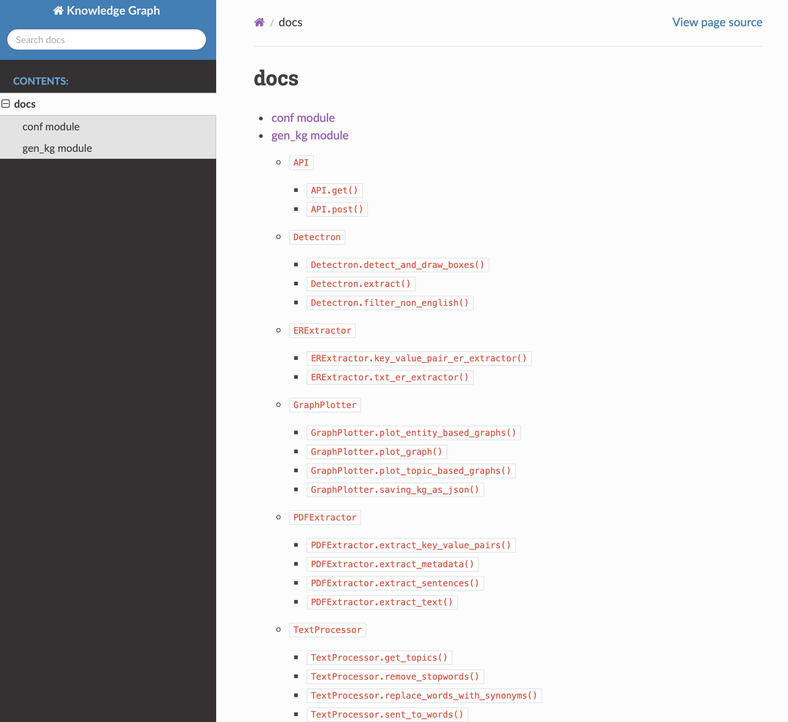
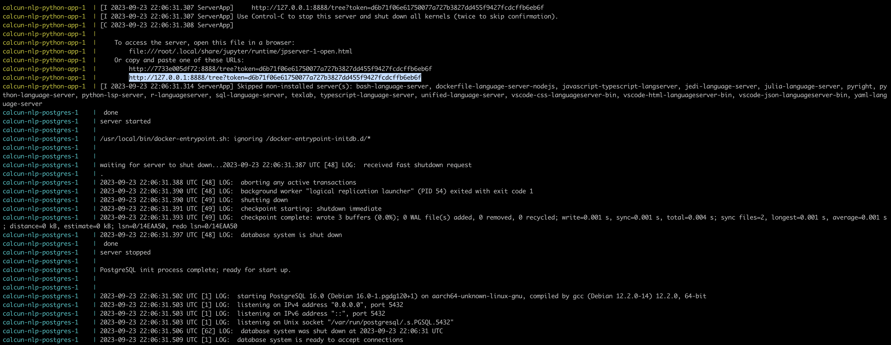
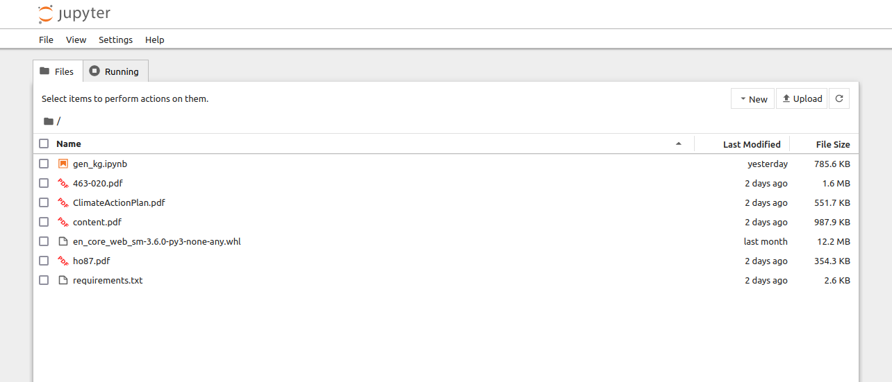

## Instructions for building and running the application
Follow the below steps:

**Building docker image**
docker build -t kg_fin:v4 .

**Running docker image**
docker run --rm -p 8888:8888 -p 9000:9000 kg_fin:v4

## Intructions for loading the Documents
To access the documents do the following steps:
1. Go into the 'docs' folder.
2. Traverse to '_build' folder.
3. Finally open the 'html' folder.
4. Double click on the 'index.html' file. The file will open in the browser.

Below is the screenshot of Doumentations:

<!-- 1. Build the Docker image locally and run it:
   
   docker-compose up
   
   The below image shows the output after successfully executing the above command.
   Please copy the complete url starting with http://127.0.0.1:8888 and past it in the browser.
   You can stop the instance by using Control+C.
   
   

2. Clone the code from 'https://github.com/spaciandd/sheeban.git' using the following command
   
   git clone https://github.com/spaciandd/sheeban.git 

3. Go into the the directory
   cd sheeeban

4. Start PG Admin4 app if you have

5. Follow the general instructions given on 'https://github.com/spaciandd/sheeban.git' to start PostgreSQL server.

6. Then based on if you are using Mac or Windows PC use 'bash setup.sh' or 'setup.bat' command.

7. Search 'http://localhost:8080' on your browser.

8. Once you run the code from 'gen_kg.ipynb' file from 'http://localhost:8888' you will be able to see few options on the Knowledge Graph tab of 
'http://localhost:8080'. -->

<!-- 2. Run the Docker container:
   
   docker run --rm -p 8888:8888 atharva212/kg_fin:v3 
   
   The below image shows the output after successfully executing the above command.
    -->

